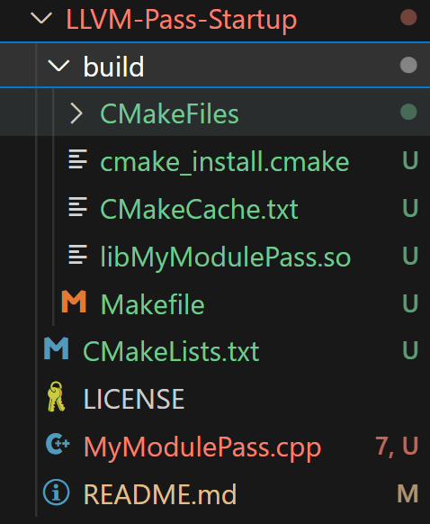
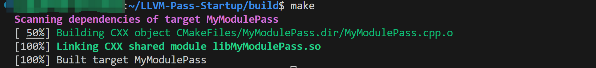
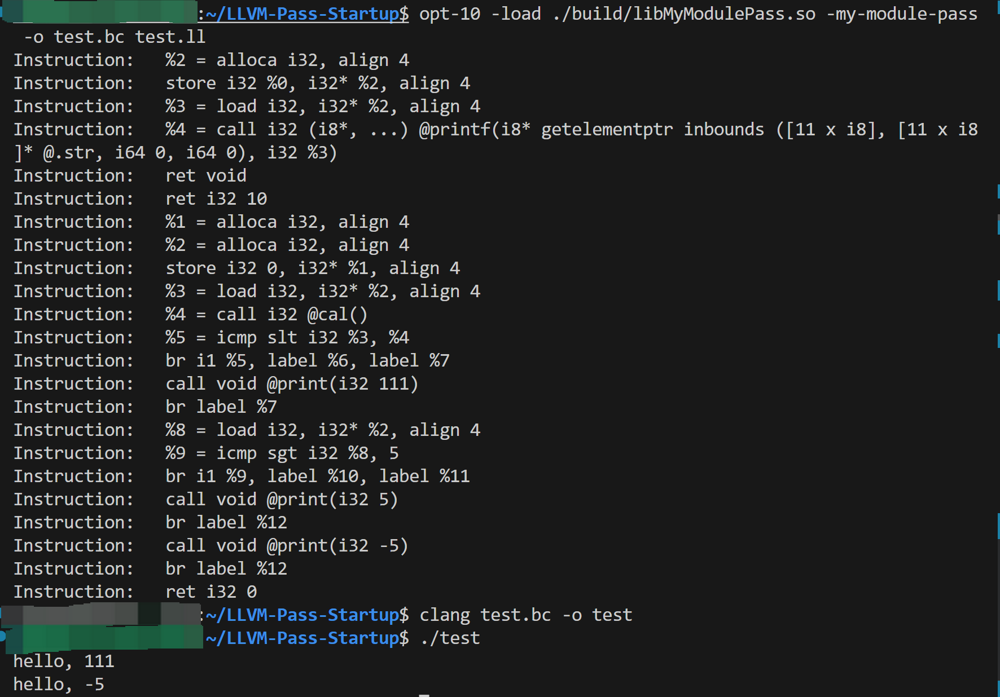

# LLVM-Pass-Startup

## Dependency

If you have not downloaded LLVM, please download it. The version I use is LLVM-10. You can use other versions.

```javascript
sudo apt-get update -y && \
    sudo apt-get -y install llvm-10 \
    clang-10
```

If you don’t have cmake, please download it.

```javascript
sudo apt-get update cmake
```

## Build

first, clone the code.

then:

```javascript
cd build/
CC=clang CXX=clang++ cmake ..
```

If you cannot find clang and clang++, please check in your /usr/bin directory and use the corresponding version. For example, you do not have clang and clang++ in your /usr/bin directory, but you have downloaded clang-10 and clang++-10 (other versions is ok too), you can use:

```javascript
CC=clang-10 CXX=clang++-10 cmake ..
```

Or you can use soft links:

```javascript
sudo ln -s /usr/bin/clang-10 /usr/bin/clang
```

If the cmake command is executed successfully, you will see the Makefile in the build directory.



Then just execute:

```javascript
make
```



## Use

As a test, you can use the following test.c:

```javascript
#include <stdio.h>

#define MAX 100

void print(int num)
{
    printf("hello, %d\n", num);
}

int cal() {
    return 10;
}

int main()
{
    int i;

    if (i < cal()) {
        print(111);
    }

    i > 5 ? print(5) : print(-5);

    return 0;
}
```

First compile it into a .ll file:

```javascript
clang -S -emit-llvm test.c -o test.ll
```

Then use the opt tool to run:

```javascript
opt-10 -load ./build/libMyModulePass.so -my-module-pass -o test.bc test.ll
```

> If you cannot find opt, please use the above method to go to /usr/bin and check the name of your opt. My name here is opt-10, or you can create another soft link.

This will generate a .bc file.

If you want to generate an executable file, continue:

```javascript
clang test.bc -o test
```

The screenshot of successful operation is as follows:


